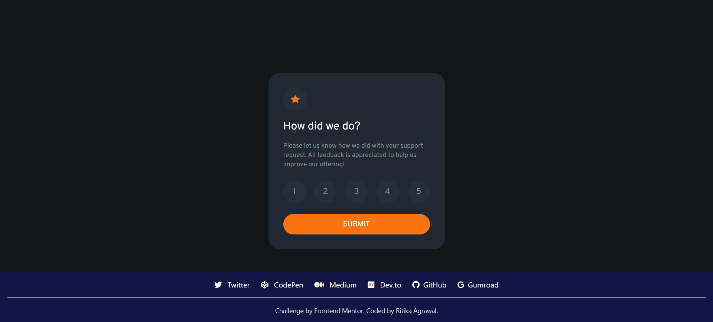

# Frontend Mentor - Interactive rating component solution

This is a solution to the [Interactive rating component challenge on Frontend Mentor](https://www.frontendmentor.io/challenges/interactive-rating-component-koxpeBUmI). Frontend Mentor challenges help you improve your coding skills by building realistic projects. 

## 📑 Table of contents

- [Overview](#overview) 📋
  - [The challenge](#the-challenge) 💪
  - [Screenshot](#screenshot) 🖼️
  - [Links](#links) 🔗
- [My process](#my-process) 🔄
  - [Built with](#built-with) 🛠️
  - [What I learned](#what-i-learned) 🧠
  - [Continued development](#continued-development) 🚀
- [Author](#author) 🖋️

## 📋 Overview

### The challenge 💪

Users should be able to:

- View the optimal layout for the app depending on their device's screen size
- See hover states for all interactive elements on the page
- Select and submit a number rating
- See the "Thank you" card state after submitting a rating

### Screenshot 🖼️

### Links 🔗

- Visit : [Solution URL](https://www.frontendmentor.io/solutions/darklight-theme-qr-code-challenge-WHcxCjlSlb)
- Visit : [Live Site URL](https://frontendmentor-challenges-iota.vercel.app/interactive-rating-component-main/index.html)

## 🔄 My process

### Built with 🛠️

- Semantic and Accessible HTML5 markup
- Tailwind CSS for styling
- JavaScript for showing the Thank You Message
- Mobile-first workflow

### What I learned

I learnt to use Tailwind CSS effectively in a simple HTML project. I also learnt to use its prettier plugin formatting the ulitily classes.

Some of the tailwind css techniques I learnt are:

1. **Adding Google Fonts to config file**

I learnt how we can import a google font in the CSS file and then add it as a class in the config file under _fontFaily_ section inside _theme_.

2. **Creating Custom Uitility Classes**

I created custom classes for colors to easily style my page.

3. **Using peer and peer-checked classes**

I discovered that with peer-checked class I can style a sibling element when a particlar _peer_ is selected. I used this to style the rating numbers when a radio button was checked.

### Continued development 🚀

I want to focus more on below topics and explore some techniques to improve my developing skills.

- **Setting up dark themes with Tailwind CSS** : I will explore on how I can add dark/light theme with Tailwind CSS

## 🖋️ Author

- Frontend Mentor - [@Ritika-Agrawal811](https://www.frontendmentor.io/profile/Ritika-Agrawal811)
- Twitter - [@RitikaAgrawal08](https://twitter.com/RitikaAgrawal08)
