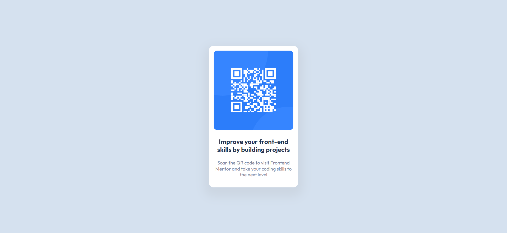

# Frontend Mentor - QR code component

This is a solution to the [QR code component challenge on Frontend Mentor](https://www.frontendmentor.io/challenges/qr-code-component-iux_sIO_H/hub). Check out Frontend Mentor! :heart_eyes: They have challenges which to improve our coding skills by building realistic projects.

## 📑 Table of contents

- [Overview](#overview) 📋
  - [The challenge](#the-challenge) 💪
  - [My additions](#my-additions) 🐙
  - [Screenshot](#screenshot) 🖼️
  - [Links](#links) 🔗
- [My process](#my-process) 🔄
  - [Built with](#built-with) 🛠️
  - [What I learned](#what-i-learned) 🧠
  - [Continued development](#continued-development) 🚀
- [Author](#author) 🖋️

## 📋 Overview

### The challenge 💪

Users should be able to:

- View the optimal layout depending on their device's screen size

### My additions 🐙

I've added below features to this challenge:

- Toggle between dark/light modes

### Screenshot 🖼️



### Links 🔗

- Visit : [Solution URL](https://www.frontendmentor.io/solutions/responsive-product-preview-card-component-RqgUQ-SCoa)
- Visit : [Live Site URL](https://frontendmentor-challenges-iota.vercel.app/product-preview-card-component-main/index.html)

## 🔄 My process

### Built with 🛠️

- Semantic HTML5 markup
- CSS Custom Properties to handle colors
- JavaScript for dark/light mode
- Mobile-first workflow

### What I learned 🧠

While completing this challenge, I learnt to use CSS custom properties and add values to local storage.

1. **Using CSS Custom Properties**

I wanted to add dark/light theme. For this I learnt to use CSS Variables to store colors for both themes in the body ruleset.

```css
body[theme="dark"] {
  --primary: #121212;
  --card-background: #1e1e1e;
  --text-color: rgba(255, 255, 255, 0.8);
  --heading-color: hsl(218, 44%, 65%);
  --box-shadow-color: transparent;
}
```

2. **Local Storage**

Learnt to store the theme in local storage provided in a browser. This helped to add the correct theme on page reload.

```js
// to set a variable in local storage
localStorage.setItem("theme", theme);

// to get a variable in local storage
const currentTheme = localStorage.setItem("theme");
```

### Continued development 🚀

I want to focus more on below topics and explore some techniques to improve my developing skills.

- **Deciding colors for dark themes** : I find it really confusing to choose colors on dark modes. So I will explore on this from the UI/UX point of view.

## 🖋️ Author

- Frontend Mentor - [@Ritika-Agrawal811](https://www.frontendmentor.io/profile/Ritika-Agrawal811)
- Twitter - [@RitikaAgrawal08](https://twitter.com/RitikaAgrawal08)
